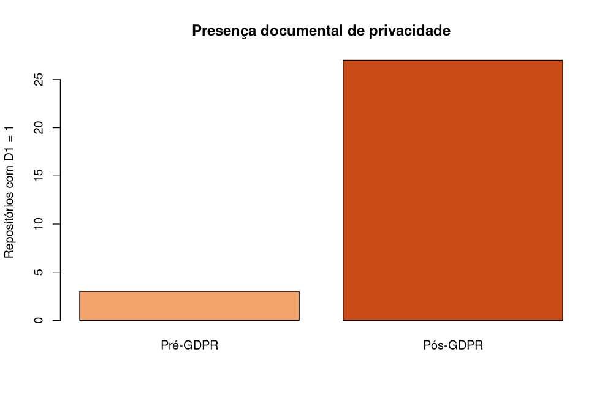
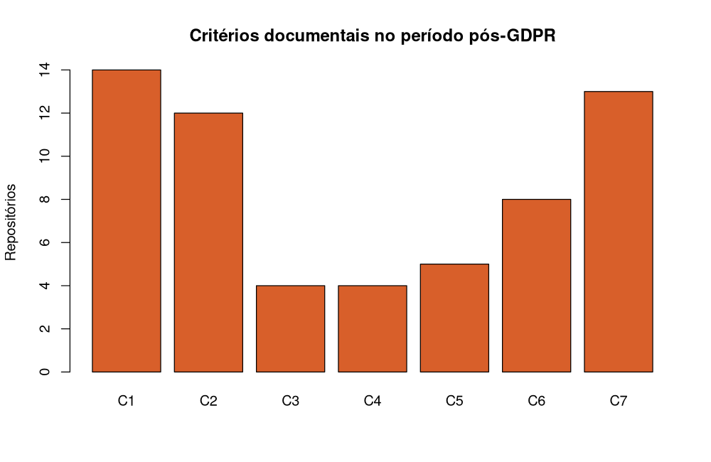

<script>window.privacySiteData={"topic_count":24,"complete_pairs":473,"selected_repositories":474,"excluded_repositories":1,"pre_d1":3,"post_d1":27,"pre_score":0.010570824524312896,"post_score":0.12684989429175475,"mcnemar_p":8.046627044677746e-07,"wilcoxon_p":2.384185791015625e-07,"selection_audit_available":true};</script>

::: {.hero-note #hero-note}
Esta página reúne a amostra final analisada, os documentos recuperados, as evidências
textuais, a metodologia, os resultados estatísticos e as instruções de
reprodução. Os valores exibidos são gerados diretamente dos artefatos
versionados no repositório.
:::

## Visão geral {#visao-geral}

::: {.metric-grid}
::: {.metric-card}
### 473
Repositórios na amostra final analisada
:::

::: {.metric-card}
### 27
D1 no período pós-GDPR
:::

::: {.metric-card}
### 0.127
PDE Score médio pós-GDPR
:::
:::

## Resultado principal {#resultado-principal}

::: {data-i18n-template="main-result"}
Na amostra final analisada, 3 de 473 repositórios
apresentaram, no período pré-GDPR, evidência documental de privacidade (D1=1). No período pós-GDPR,
foram 27 repositórios. O teste exato de McNemar bicaudal resultou em
8,05e-07.
:::

::: {data-i18n-template="score-result"}
O PDE Score médio passou de 0,011 para
0,127. O teste exato de Wilcoxon pareado resultou em
2,38e-07.
:::

## Cobertura do vocabulário {#cobertura-vocabulario}

::: {data-i18n-template="vocabulary-coverage"}
A busca usa 24 tópicos de IA/ML, incluindo subdomínios
e áreas recentes. Os mesmos critérios de elegibilidade e análise documental são
aplicados a todos os resultados; os tópicos servem como sinais de descoberta,
não como prova automática de escopo técnico.
:::

<table>
<caption>Tópicos presentes na amostra final analisada</caption>
 <thead>
  <tr>
   <th style="text-align:left;"> Tópico </th>
   <th style="text-align:right;"> Repositórios </th>
  </tr>
 </thead>
<tbody>
  <tr>
   <td style="text-align:left;"> machine-learning </td>
   <td style="text-align:right;"> 243 </td>
  </tr>
  <tr>
   <td style="text-align:left;"> deep-learning </td>
   <td style="text-align:right;"> 153 </td>
  </tr>
  <tr>
   <td style="text-align:left;"> image-processing </td>
   <td style="text-align:right;"> 56 </td>
  </tr>
  <tr>
   <td style="text-align:left;"> nlp </td>
   <td style="text-align:right;"> 53 </td>
  </tr>
  <tr>
   <td style="text-align:left;"> computer-vision </td>
   <td style="text-align:right;"> 49 </td>
  </tr>
  <tr>
   <td style="text-align:left;"> natural-language-processing </td>
   <td style="text-align:right;"> 40 </td>
  </tr>
  <tr>
   <td style="text-align:left;"> neural-network </td>
   <td style="text-align:right;"> 40 </td>
  </tr>
  <tr>
   <td style="text-align:left;"> artificial-intelligence </td>
   <td style="text-align:right;"> 38 </td>
  </tr>
  <tr>
   <td style="text-align:left;"> reinforcement-learning </td>
   <td style="text-align:right;"> 27 </td>
  </tr>
  <tr>
   <td style="text-align:left;"> object-detection </td>
   <td style="text-align:right;"> 20 </td>
  </tr>
  <tr>
   <td style="text-align:left;"> llm </td>
   <td style="text-align:right;"> 14 </td>
  </tr>
  <tr>
   <td style="text-align:left;"> convolutional-neural-networks </td>
   <td style="text-align:right;"> 10 </td>
  </tr>
  <tr>
   <td style="text-align:left;"> ai-agents </td>
   <td style="text-align:right;"> 7 </td>
  </tr>
  <tr>
   <td style="text-align:left;"> transformer </td>
   <td style="text-align:right;"> 7 </td>
  </tr>
  <tr>
   <td style="text-align:left;"> image-classification </td>
   <td style="text-align:right;"> 5 </td>
  </tr>
  <tr>
   <td style="text-align:left;"> transformers </td>
   <td style="text-align:right;"> 5 </td>
  </tr>
  <tr>
   <td style="text-align:left;"> deep-neural-network </td>
   <td style="text-align:right;"> 2 </td>
  </tr>
  <tr>
   <td style="text-align:left;"> multimodal </td>
   <td style="text-align:right;"> 2 </td>
  </tr>
  <tr>
   <td style="text-align:left;"> large-language-models </td>
   <td style="text-align:right;"> 1 </td>
  </tr>
  <tr>
   <td style="text-align:left;"> machine-intelligence </td>
   <td style="text-align:right;"> 1 </td>
  </tr>
</tbody>
</table>

## Resultados detalhados {#resultados}

### Presença documental (D1)



| Medida | Resultado |
|---|---:|
| D1 pré-GDPR | 3 (0.6%) |
| D1 pós-GDPR | 27 (5.7%) |
| Pré 1 → pós 0 | 1 |
| Pré 0 → pós 1 | 25 |
| p exato de McNemar bicaudal | 8,05e-07 |

### PDE Score



| Medida | Pré | Pós |
|---|---:|---:|
| Média | 0.011 | 0.127 |
| Mediana | 0.000 | 0.000 |
| IQR | 0–0 | 0–0 |

| Medida pareada | Resultado |
|---|---:|
| Aumentos / reduções / iguais | 23 / 0 / 450 |
| W+ / W− | 276.0 / 0.0 |
| p exato de Wilcoxon bicaudal | 2,38e-07 |
| Correlação bisserial de postos | 1.000 |

### Frequência dos critérios

<table>
<caption>Frequência de C1 a C7</caption>
 <thead>
  <tr>
   <th style="text-align:left;"> Critério </th>
   <th style="text-align:right;"> Pré </th>
   <th style="text-align:right;"> Pós </th>
  </tr>
 </thead>
<tbody>
  <tr>
   <td style="text-align:left;"> C1 </td>
   <td style="text-align:right;"> 2 </td>
   <td style="text-align:right;"> 14 </td>
  </tr>
  <tr>
   <td style="text-align:left;"> C2 </td>
   <td style="text-align:right;"> 1 </td>
   <td style="text-align:right;"> 12 </td>
  </tr>
  <tr>
   <td style="text-align:left;"> C3 </td>
   <td style="text-align:right;"> 0 </td>
   <td style="text-align:right;"> 4 </td>
  </tr>
  <tr>
   <td style="text-align:left;"> C4 </td>
   <td style="text-align:right;"> 0 </td>
   <td style="text-align:right;"> 4 </td>
  </tr>
  <tr>
   <td style="text-align:left;"> C5 </td>
   <td style="text-align:right;"> 1 </td>
   <td style="text-align:right;"> 5 </td>
  </tr>
  <tr>
   <td style="text-align:left;"> C6 </td>
   <td style="text-align:right;"> 1 </td>
   <td style="text-align:right;"> 8 </td>
  </tr>
  <tr>
   <td style="text-align:left;"> C7 </td>
   <td style="text-align:right;"> 0 </td>
   <td style="text-align:right;"> 13 </td>
  </tr>
</tbody>
</table>

### Transições observadas em D1

<table>
<caption>Matriz de transição de D1</caption>
 <thead>
  <tr>
   <th style="text-align:left;">   </th>
   <th style="text-align:right;"> Pós = 0 </th>
   <th style="text-align:right;"> Pós = 1 </th>
  </tr>
 </thead>
<tbody>
  <tr>
   <td style="text-align:left;"> Pré = 0 </td>
   <td style="text-align:right;"> 445 </td>
   <td style="text-align:right;"> 25 </td>
  </tr>
  <tr>
   <td style="text-align:left;"> Pré = 1 </td>
   <td style="text-align:right;"> 1 </td>
   <td style="text-align:right;"> 2 </td>
  </tr>
</tbody>
</table>

## Dados coletados {#dados}

### Amostra final analisada

::: {data-i18n-template="sample-description"}
A amostra final analisada contém 473 repositórios com licença identificada por
SPDX e aprovada pela OSI. Ela corresponde aos pares históricos completos efetivamente
usados na análise estatística. Todos os indicadores, proporções, médias, frequências,
tabelas e gráficos de resultados usam este mesmo conjunto.
:::

::: {data-i18n="sampleFilesText"}
A amostra final analisada está disponível em
[analyzed_sample.csv](outputs/tables/analyzed_sample.csv). O
vocabulário configurado está em
[ai_ml_topics_used.csv](inputs/reference/ai_ml_topics_used.csv).
:::

### Arquivos para inspeção

::: {data-i18n="inspectionIntro"}
Os registros detalhados não são repetidos na página. Os repositórios da amostra final
analisada, seus documentos, classificações, evidências e metadados permanecem
disponíveis nos arquivos versionados abaixo:
:::

::: {data-i18n="dataLinksList"}
- [Dataset da amostra final analisada](outputs/tables/analyzed_dataset.csv)
- [Amostra final analisada](outputs/tables/analyzed_sample.csv)
- [Evidências positivas](outputs/tables/positive_evidence.csv)
- [Manifesto da execução](outputs/metadata/manifest.json)
:::
::: {data-i18n-template="selection-manifest"}
[Manifesto das consultas de seleção](outputs/metadata/selection_search_manifest.json)
:::

## Metodologia {#metodologia}

### Desenho

::: {data-i18n="designText"}
O estudo compara o mesmo conjunto de repositórios em dois snapshots
históricos: o último commit até `2018-05-24T23:59:59Z` e o último commit até
`2026-06-30T23:59:59Z`. A unidade de análise é o repositório público de IA/ML.
:::

```{mermaid}
%%{init: {"themeVariables": {"fontSize": "18px", "fontFamily": "Montserrat, Arial, sans-serif"}, "flowchart": {"nodeSpacing": 64, "rankSpacing": 88, "diagramPadding": 28, "wrappingWidth": 300, "minNodeWidth": 280}}}%%
flowchart TD
  A[Busca por 24 tópicos IA/ML] --> B[Particionamento temporal até 1000 resultados]
  B --> C[Filtros de seleção preservados]
  C --> D[Amostra congelada]
  D --> E[Snapshot pré-GDPR]
  D --> F[Snapshot pós-GDPR]
  E --> G[Classificação C1-C7 e D1]
  F --> G
  G --> J[Amostra final analisada: pares históricos completos]
  J --> H[McNemar e Wilcoxon]
  H --> I[Dataset, relatórios e site]
```

### Seleção da amostra

::: {data-i18n-template="sample-flow"}
Repositórios inicialmente selecionados: 474.
Repositórios excluídos por ausência de par histórico completo válido para análise: 1.
Repositórios na amostra final analisada: 473.
Os critérios de inclusão e os métodos estatísticos permanecem os mesmos.
:::

::: {data-i18n="traceabilityLinks"}
A seleção inicial, os registros completos e as exclusões são preservados para rastreabilidade:

- [Seleção inicial desta execução](outputs/tables/sample_used.csv)
- [Dataset completo para rastreabilidade](outputs/tables/final_privacy_gdpr_dataset.csv)
- [Checkpoint bruto JSONL](inputs/raw/repository_results.jsonl)
- [Contagens e repositórios excluídos](outputs/metadata/statistics.json)
:::

::: {data-i18n-template="selection-description"}
O seletor consulta 24 tópicos configurados em
`config/settings.yml`, que abrangem áreas como visão computacional, processamento de
linguagem natural, detecção de objetos, LLMs, transformers, IA generativa,
difusão, multimodalidade, RAG e agentes. Em seguida, aplica os critérios de
visibilidade pública, licença SPDX/OSI aprovada, ausência de fork e
arquivamento, criação anterior a `2018-05-25T00:00:00Z`, pelo menos 500 estrelas,
pelo menos 100 issues reais, atividade mínima de 24 meses e atividade antes e
depois da data de referência.
:::

::: {data-i18n="partitionText"}
As consultas são particionadas por data de criação quando a contagem ultrapassa
o limite de 1.000 resultados da Search API. As partições e páginas baixadas
ficam registradas no manifesto de seleção.
:::

::: {data-i18n-template="selection-manifest"}
O manifesto desta execução está disponível nos artefatos.
:::

::: {data-i18n="selectionAfter"}
A primeira etapa é `Rscript main.R --select`: ela cria uma amostra nova e coleta
os snapshots históricos desses repositórios. Depois, `Rscript main.R --analyze`
valida a coleta, refaz a análise offline e gera o site. O comando
`Rscript main.R --run` executa o processo inteiro do início ao fim.
:::

### Documentação e critérios

::: {data-i18n="documentationIntro"}
São analisados README de raiz e documentos textuais cujos nomes ou caminhos
indicam privacidade, segurança, proteção de dados, termos, consentimento,
retenção ou conformidade. D1 indica evidência documental contextualizada. O
PDE Score soma sete critérios:
:::

::: {data-i18n="criteriaList"}
1. dados pessoais;
2. finalidade do tratamento;
3. base legal;
4. direitos dos titulares;
5. retenção ou exclusão;
6. compartilhamento ou transferência;
7. proteção contra vazamento ou acesso não autorizado.
:::

::: {data-i18n="documentationNegative"}
Menções isoladas, bibliografia, testes, exemplos, dependências e listas de
links não são suficientes para marcar um critério.
:::

### Estatística

::: {data-i18n="statisticsText"}
Para D1, o pipeline calcula o teste exato de McNemar bicaudal. Para o PDE
Score, calcula o teste exato de Wilcoxon pareado bicaudal, excluindo diferenças zero e
usando postos médios em empates. O nível de significância adotado é
$\alpha=0{,}05$.
:::

::: {.pvalue-note}
::: {data-i18n-template="pvalue-explanation"}
O *p-value* é a probabilidade de observar um resultado tão extremo quanto o
obtido, ou mais extremo, supondo que a hipótese nula (H0) seja verdadeira. Com
$\alpha=0{,}05$, um *p-value* menor que α leva à rejeição de H0; um valor maior
ou igual a α não permite rejeitá-la. Essa decisão não prova H1 nem transforma
H0 em uma verdade automática.
:::

::: {data-i18n-template="pvalue-result"}
Neste estudo, o *p-value* exato de McNemar foi 8,05e-07
e o de Wilcoxon foi 2,38e-07. A decisão estatística deve
acompanhar os resultados da amostra final analisada em cada execução e deve
considerar o tamanho das diferenças e as limitações do desenho observacional.
:::
:::

::: {data-i18n="resultLimitations"}
Os resultados medem evidência documental versionada. Eles não constituem
auditoria jurídica nem permitem atribuir causalidade exclusiva à GDPR.
:::

## Reprodução {#reproducao}

### Requisitos

::: {data-i18n="requirementsList"}
- R 4.6 ou superior;
- `R6`, `jsonlite` e `yaml` para o pipeline;
- `knitr`, `rmarkdown` e Quarto para renderizar este site;
- executável `curl` disponível no PATH para novas chamadas à API do GitHub;
- token `GITHUB_TOKEN` somente quando uma nova coleta for necessária.
:::

### Pipeline completo

::: {data-i18n="completePipelineIntro"}
Para executar todo o fluxo do zero — nova seleção, coletas, análise e site:
:::

```bash
export GITHUB_TOKEN="seu-token"
Rscript main.R --run
```

::: {data-i18n="newSampleIntro"}
Para gerar uma nova amostra e coletar os dois snapshots históricos:
:::

```bash
Rscript main.R --select
```

::: {data-i18n="analyzeIntro"}
Depois de `--select` terminar, para executar a análise offline e gerar o site:
:::

```bash
Rscript main.R --analyze
```

::: {data-i18n="statusText"}
O `main.R` mostra o progresso por etapa e grava o estado em
`outputs/metadata/run_status.json`. Durante a seleção, informa tópico, páginas
e resultados; na seleção e na coleta, informa a contagem de repositórios
aprovados ou processados em relação ao total, a cada 60 segundos e ao concluir.
Quando um limite da API interrompe o avanço, informa que está aguardando a renovação.
:::

::: {data-i18n="stagedModeNote"}
O modo `--analyze` exige a coleta completa da amostra atual, produzida por
`--select` ou `--run`. O pipeline oferece apenas `--run`, `--select`,
`--analyze` e `--help`.
:::

::: {data-i18n="helpIntro"}
Para consultar a ajuda do pipeline:
:::

```bash
Rscript main.R --help
```

### Artefatos

::: {data-i18n="artifactsIntro"}
O repositório mantém a amostra final analisada, os registros de rastreabilidade, o checkpoint bruto, o dataset, as
evidências positivas, as estatísticas, os gráficos e os relatórios. O arquivo
`outputs/metadata/manifest.json` registra os hashes e versões usados na execução.
:::

## Referências metodológicas {#referencias-metodologicas}

::: {data-i18n="referencesText"}
Os 24 termos pesquisados servem exclusivamente para descobrir repositórios do
GitHub. Doze etiquetas são enumeradas por Openja et al. (2024);
natural-language-processing é citado por Gonzalez, Zimmermann e Nagappan
(2020); e as onze escolhas restantes do protocolo são nlp mais dez termos
adicionais. O CSV distingue a origem histórica da escolha do apoio conceitual.
Kumar (2024) apoia o conceito de LLMs; Vaswani et al. (2017), Transformers;
Feuerriegel et al. (2024), IA generativa e multimodalidade; Ho et al. (2020),
difusão; Lewis et al. (2020), RAG; e Wang et al. (2024), agentes. Essas fontes
conceituais não forneceram a lista de busca.

Gonzalez et al. (2020) é o estudo de Danielle Gonzalez, Thomas Zimmermann e
Nachiappan Nagappan sobre repositórios do GitHub. É distinto do trabalho de
Alexandra González et al. (2024) sobre repositórios do Hugging Face, que está
fora do escopo e não fundamenta este protocolo. O artigo 99(2) do Regulamento
(UE) 2016/679 estabelece a data de aplicação da GDPR; McNemar (1947), Wilcoxon
(1945) e Efron (1979) fundamentam os métodos estatísticos efetivamente usados.
Consulte a [bibliografia e proveniência metodológica](inputs/reference/literature_methods.md).
:::

<script src="site/site.js"></script>
